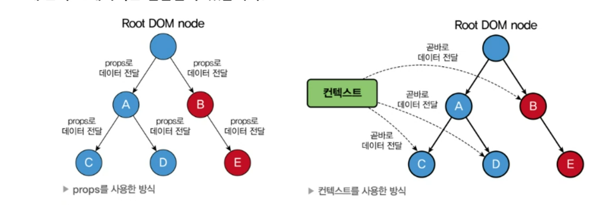

# 심재휘 202030316

2️⃣ [2주차](#2024-03-13-강의-내용)  
3️⃣ [3주차](#2024-03-20-강의-내용)  
5️⃣ [5주차](#2024-04-03-강의-내용)  
7️⃣ [7주차](#2024-04-17-강의-내용)  
9️⃣ [9주차](#2024-05-01-강의-내용)  
1️⃣0️⃣ [10주차](#2024-05-08-강의-내용)  
1️⃣2️⃣ [12주차](#2024-05-22-강의-내용)  
1️⃣3️⃣ [13주차](#2024-05-29-강의-내용)  
1️⃣4️⃣ [14주차](#2024-06-05-강의-내용)  
1️⃣5️⃣ [15주차(보강 1)](#2024-06-11-강의-내용)  
1️⃣6️⃣ [15주차(보강 2)](#2024-06-12-강의-내용)

## 2024-06-12 강의 내용
### css
#### CSS란?
 1. Css는 Cascading Style Sheets의 약자로 스타일링을 위한 언어임
 2. Cascading이란 계단식이라는 뜻으로 한 엘리먼트에 여러 스타일이 적용될 경우 스타일간의 충돌을 막기 위해 계단식으로 스타일을 적용시키는 규칙을 갖고 있음.
 3. 즉 하나의 스타일이 여러 개의 엘리먼트에 적용될 수도 있고, 하나의 엘리먼트에도 여러 개의 스타일이 적용될 수도 있음
 4. 엘리먼트에 스타일이 적용되는 규칙을 selector(선택자)라고 함. CSS는 이 선택자와 스타일로 이루어 짐.
 5. 이번 장에서는 선택자와 스타일을 카테고리별로 나누어 학슴함
#### CSS 문법과 선택자
 1. 선택자를 먼저 쓰고 다음에 적용할 스타일을 중괄호 안에 세미콜론으로 구분하여 하나씩 작성함
 
 2. 선택자는 HTML 엘리먼트를 직접 넣어도 되고, 엘리먼트의 조합 혹은 class의 형태로 작성 가능함
 3. 스타일은 property(속성)과 key value(키 값)로 이루어 지며, 이들은 콜론으로 구분하고, 각 스타일은 세미콜론으로 구분함
 4. 고재는 몇가지 선택자의 예를 설명하고 있음
 5. 첫 번째는 태그를 직접 사용하는 것
 ```css
 h1{
  color: green;
 }
 ```
 6. 두 번째는  id 선택자를 설명하고 있는데 이 것은 절대 사용하지 마라. js에서 id를 사용하잖아
 7. 세 번째는 class선택자임. HTML 태그로 특정할 수 없는 스타일은 모두 class로 정의함
 ```js
<span class="medium">
</span>
<p class="medium">
</p>
.medium {
  font-size: 20px;
}
p.medium {
  font-size: 20px
}
 ```
8. 여섯 번째는 상태 선택자임

```css
button:hover {
  font-weight: bold;
}
a:active {
  color: red;
}
input:focus {
  color: #000000;
}
option:checked {
  background: #00ff00;
}
p:first-child {
  background: #ff0000;
}
p:last-child {
  background: #0000ff;
}
```
#### 레이아웃과 관련된 속성
 1. 화면에 엘리먼트를 어떻게 배치할 것인지를 정의함
 2. 가장 중요한 속성은 display
 3. 모든 엘리먼트는 기본 display 속성을 갖고 있지만 이 기본값을 변경해 줄 수 있음
 ```css
 div {
  display: none | block | inline | flex;
 }
 ```
 4. none는 존재는 하지만 화면에 보이지 않는 것으로, js를 넣을 때 많이 사용함
 5. block은 세로로 정렬되며, width의 height를 갖을 수 있음. 크기와 상관없이 한 줄을 점유함
 6. inline은 가로로 정렬되며, width의 height를 갖을 수 없음. 컨텐츠의 크기만큼 공간을 점유함
 7. inline-block는 기본적으로 inline의 특성을 갖지만, width와 height등 block의 특성을 사용할 수 있음
 8. 대표적인 blockrhk inline태그는 다음과 같음   
   __Block: div table h1 ~ h6 p ul ol li dl dt dd pre 등__
   __inline: span, a, br, em, strong, input, label, img 등__
 9. flex는 컨테이너의 형태로 엘리먼트를 관리함. Mozilla 참고
 10. 최근 들어서는 Grid를 많이 사용함. Flex가 1차원 적이라면 Grid는 2차원 적으로 관리가 가능하기 때문. Mozilla 참고
 11. visibility 속성은 엘리먼트의 가시성을 정의함
 ```css
 div {
  visibility: visible | hidden;
 }
 ```
 12. 여기서 중요한 것은 display:nonerhk visibility:hidden의 차이임
 13. display:none은 엘리먼트의 영역이 보이지 않고, visibility:hidden는 차지하는 영역은 보임
 14. 다음으로 position 속성은 엘리먼트를 어떻게 위치시킬 것인지를 정의함
 ```css
 div{
  position:static | fixed | relative | absolute;
 }
 ```
 15. static은 원래 순서대로 위치 시킴
 16. fixed는 window에 상대적위치라고 정의 하지만 지금은 sticky로 바뀜.
 17. relative는 상대적, absolute는 절대적 위치를 지정함
 18. 다음으로 엘리먼트의 크기를 나타내는 속성임
 ```css
 div{
  width
 }
 ```
 19. flex box
 ```css
 div{
  display: flex;
  flex-direction: row | column | row-reverse | column-reverse;
  align-items: stretch | flex-start | center | flex-end | baseline;
  justify-content: flex-start | center | flex-end | space-between | space-around;
 }
 ```
 20. 폰트와 관련된 속성
 ```css
 #title {
  font-family: "사용할 글꼴 이름", <일반적인 글꼴 분류>;
  font-size: value;
  font-weight: normal | bold;
  font-style: normal | italic | oblique;
 }
 ```
 
 21. font-size 등 크기를 나타내는 단위로는 px, em, rem, vm 등이 있음
 22. 1em은 16px과 동일함. 다음을 참고해라.   
 http://www.w3schools.com/cssref/css_pxtoemconversion.php   
 23. font-style 속성은 다음과 같다. 
   
 24. 많이 사용하는 기타 속성
   
  *HUE : hsl(hue, saturation, lightness)

### styled-components
 1. CSS 문법을 그대로 사용하면서 결과물을 스타일링된 컴포넌트 형태로 만들어 주는 오픈소스 라이브러리임
 2. 컴포넌트의 개념을 사용하고 있어 리액트 개발에 많이 사용됨
 #### styled-components 섳리하기
 1. npm install --save styled-compoenets
 2. 교재에는 위와 같이 나와 있지만 npm v5부터는 사용하지 않아도 됨. 자동추가
 3. 440 페이지 코드처럼 import 해서 사용하면 됨
 #### styled-components 기본 사용법
 1. 태그드 템플릿 리터럴을 사용하여 구성 요소의 스타일을 지정함
 2. 태그드 템플릿 리터럴은 js에서 제공하는 문법 중 하나로 리터럴을 템플릿 형태로 사용하는 것
 3. sytled.<HTML tag>`...` 의 형태로 정의한 후 컴포넌트를 생성해서 사용함
 #### styled-components의 props 사용하기
 1. props를 이용하여 조건이나 동적으로 변하는 값을 사용해서 스타일링을 할 수 있음
 2. 페이지 445 참고
 #### styled-components의 스타일 확장하기
 1. 먼저 정의한 스타일 컴포넌트에 스타일을 추가하여 재정의 하는 것
 #### styled-components를 사용하여 스타일링해 보기
 1. Block 컴포넌트를 만들어 styled-components를 적용해 보자

  


## 2024-06-11 강의 내용
### Specialization (특수화, 전문화)
 1. 웰컴 다이얼로그는 다이얼로그의 특별한 케이스
 2. 범용적인 개념을 구별이 되게 구체화하는 것을 특수화라고 함
 3. 객체지향 언어에서는 상속으 사용하여 특수화를 구현함
 4. 리액트에서는 합성을 사용하여 특수화를 구현함
 5. 특수화는 범용적으로 쓸 수 있는 컴포넌트를 만들어 놓고 이를 특수한 목적으로 사용하는 합성 방식
 ```js
 function Dialog(props){
  return (
    <FancyBorder color="blue">
      <h1 className="Dialog-title">
        {props.title}
      </h1>
      <p className="Dialog-message">
        {props.message}
      </p>
    </FancyBorder>
  );
 }

 function WelcomeDialog(props){
  return (
    <Dialog
      title ="어서 오세요" message = "우리 사이트에 방문하신 것을 환영합니다!"
      />
  );
 }
 ```
### Containment와 Specialization을 같이 사용하기
 1. Containment를 위해서 props.children을 사용하고, Specialization을 위해 직접 정의한 props를 사용하면 됨
 2. 페이지 376의 코드를 참고하세요.
 3. Dialog컴포넌트는 이전의 것과 비슷한데 Containment를 위해 끝부분에 props.children을 추가함
 4. Dialog를 사용하는 SignUpDialog는 Specialization을 위해 props인 title, message에 값을 넣어주고 있고, 입력을 받기위해 input태그와 button태그를 사용함
 5. 이러한 형태로 Containment와 Specialization을 동시에 사용할 수 있음

### 상속에 대해 알아보기
 1. 합성과 대비되는 개념으로 상속(inheritance)이 있음
 2. 자식 클래스는 부모 클래스가 가진 변수나 함수 등의 속성을 모두 갖게 되는 개념임
 3. 하지만 리액트에서는 상속보다는 합성을 통해 새로운 컴포넌트를 생성함
  * 복잡한 컴포넌트를 쪼개 여러 개의 컴포넌트로 만들고, 만든 컴포넌트들을 조합하여 새로운 컴포넌트를 만들자!

### 컨텍스트란 무엇인가?
 1. 기존의 일반적인 리액트에서는 데이터가 컴포넌트의 props를 통해 부모에서 자식으로 단방향으로 전달되었습니다.
 2. 컨텍스트는 리액트 컴포넌트들 사이에서 데이터를 기존의 props를 통해 전달하는 방식 대신 '컴포넌트 트리를 통해 곧바로 컴포넌트에 전달하는 새로운 방식'을 제공함
 3. 이 것을 통해 어떤 컴포넌트라도 쉽게 데이터에 접근할 수 있음.
 4. 컨텍스트를 사용하면 일일이 props로 전달할 필요 없기 그림처럼 데이터를 필요로 하는 컴포넌트에 곧바로 데이터를 전달할 수 있음.
 

### 언제 컨텍스트를 사용해야 할까?
 1. 여러 컴포넌트에서 자주 필요로 하는 데이터는 로그인 여부, 로그인 정보, UI테마, 현재 선택된 언어 등이 있음.
 2. 이런 데이터들을 기존의 방식대로 컴포넌트의 props를 통해 넘겨주는 예를 페이지 382에서 보여주고 있음
 3. 예재에서 처럼 props를 통해 데이터를 전달하는 기존 방식은 실제 데이터를 필요로 하는 컴포넌트까지의 깊이가 깊어질 수록 복잡해 짐
 4. 또한 반복적인 코드를 계속해서 작성해 주어야 하기 때문에 비효율적이고 가독성이 떨어짐
 5. 컨텍스트 사용하면 이러한 방식을 깔끔하게 개선할 수 있음
 6. 페이지 383의 예제는 컨텍스트를 사용한 예임
 7. React,createContext()함수를 사용해서 ThemeContext라는 이름의 컨텏트를 생성함.
 8. 컨텍스트를 사용하려면 컴포넌트의 상위 컴포넌트에서 Provider를 사용해야 함

### 컨텍스트를 사용하기 전에 고려할 점
 1. 컨텍스트는 다른 레벨의 많은 컴포넌트가 특정 데이터를 필요로 하는 경우에 주로 사용함
 2. 하지만 무조건 컨텍스트를 사용하는 것이 좋은게 아님
 3. 컴포넌트와 컨텍스트가 연동되면 재사용성이 떨어지기 때문
 4. 따라서 다른 레벨의 많은 컴포넌트가 데이터를 필요로 하는 경우가 아니면 props를 통해 데이터를 전달하는 컴포넌트 합성 방법이 더 적합 함
 5. 페이지 395예제처럼 실제 user와 avatarSize를 사용하는 것은 Avatar컴포넌트 뿐인데 여러 단계에 걸쳐 props를 전달하고 있음
 6. 이런 경우 컨텍스트를 사용하지 않고 문제를 해결할 수 있는 방법은 Avatar컴포넌트를 변수에 저장하여 직접 넘겨주는 것이다
 7. 이렇게 하면 중간 단계의 컴포넌트들은 user와 avatarSize에 대해 몰라도 됨
 8. 하지만 396페이지의 예제가 모든 상황에서 좋은 것은 아님
 9. 데이터가 많아질수록 상위 컴포넌트가 점점 더 복잡해지기 때문
 10. 이런 경우 하위 컴포넌트를 여러 개의 변수로 나눠줘서 전달하면 됨
 11. 397 페이지 예제 참고하셈
 12. 하지만 어떤 경우에는 하나의 데이터에 다양한 레벨에 있는 중첩된 컴포넌트들의 접근이 필요할 수 있음
 13. 이런 경우라면 컨텍스트가 유리함
 14. 컨텍스트는 해당 데이터와 데이터의 변경사항을 모두 하위 컴포넌트들에게 broadcast해주기 때문임
 15. 컨텍스트를 사용하기에 적합한 데이터의 대표적인 예로는 '지역 정보', 'UI테마' 그리고 '캐싱된 데이터' 등이 있음.

### 컨텍스트 API
 1. 이 절에서는 리액트에서 제공하는 컨텍스트 API를 통해 컨텍스트를 어떻게 사용하는지에 대해 알아보자.  
####  [1] React,createContext  
 1. 컨텍스트를 생성하기 위한 함수임
 2. 파라미터에는 기본값을 넣어주면 됨
 3. 하위 컴포넌트는 가장 가까운 상위 레벨의 Provider로 부터 컨텍스트를 받게 되지만, 만일 Provider를 찾을 수 없다면 위에서 설정한 기본값은 사용하게 됨.
 ```js
 const MyContext = React.createContext(기본값);
 ```
#### [2] Context.Provider
 1. Context.Provider컴포넌트로 하위 컴포넌트들을 감싸주면 모든 하위 컴포넌트들이 해당 컨텍스트의 데이터에 접근할 수 있게 됨
 ```js
 <MyContext.Provider value = {/* some vlaue */}>
 ```
 2. provider컴포넌트에는 value라는 prop이 있고, 이것은 Provider 컴포넌트 하위에 있는 컴포넌트에게 전달 됨
 3. 하위 컴포넌트를 consumer 컴포넌트라고 부름
 4. 페이지 389 Note, Provider vlaue에서 주의해야 할 사항 참고
#### [3] Class.contextType
 1. Provider 하위에 있는 클래스 컴포넌트에서 컨텍스트의 데이터에 접근하기 위해 사용됨
 2. Class컴포넌트는 더 이상 사용하지 않으므로 참고만 하셈
 #### [4] Context.Consumer
 1. 함수형 컴포넌트에서 Context.Consumer를 사용하여 컨텍스트를 구독할 수 있다.
 ```js
 <MyContext.Consumer>
  {value => /* 컨텍스트의 값에 따라서 컴포넌트들을 렌더링 */}
  </MyContext.Consumer>
 ```
 2. 컴포넌트의 자식으로 함수가 올 수 있는데 이것을 function as a child라고 부름
 3. Context.Consumer로 감싸주면 자식으로 들어간 함수가 현재 컨텍스트의 value를 받아서 리액트 노드로ㅓ 리턴함
 4. 함수로 전달되는 value는 Provider의 value.....
 #### [5] Context.displayName
 1. 컨텍스트 객체는 displayName이라는 문자열 속성을 갖는다
 2. 크롬의 리액트 개발자 도구에서는 컨텍스트의 Provider나 Consumer를 표시할 때 displayName을 함께 표시해 줌
```js
const MyContext = React.createContext(/* some value */);
MyContext.displayName = 'MyDisplayName';
// 개발자 도구에 "MyDiusplayName.Provider"로 표시됨
<MyContext.display/>

// 개발자 도구에 "MyDisplayName.Consumer"로 표시됨
<MyContext.Consumer/>
```

### 여러 개의 컨텍스트 사용하기
 1. 여러 개의 컨텍스트를 동시에 사용하려면 Context.Provider를 중첩해서 사용함
 2. 예제 코드는 페이지 403 ~ 404에 있음
 3. 이런 방법으로 여러 개의 컨텍스트를 동시에 사용할 수 있음
 4. 하지만 두 개 또는 그 이상의 컨텍스트 값이 자주 함께 사용될 경우 모든 값을 한 번에 제공해주는 별도의 render prop컴포넌트를 직접 만드는 것을 고려하는 것이 좋음

### useContext
 1. 함수형 컴포넌트에서 컨텍스트를 사용하기 위해 컴포넌트를 매번 Consumer 컴포넌트로 감싸주는 것 보다 더 좋은 방법이 있음. 바로 7장에서 배운 Hook이다
 2. useContext()훅은 React.createContext()함수 호출로 생성된 컨텍스트 객체를 인자로 받아서 현재 컨텍스트의 값을 리턴함
 ```js
 function MyComponent(props){
  const value = useContext(MyContext);

  return (
    ...
  )
 }
 ```

## 2024-06-05 강의 내용
### 하위 컴포넌트에서 State공유하기
 1. 물의 끓음 여부를 알려주는 BoilingVerdict컴포넌트 만듬
 2. 다음으로 Calculator 컴포넌트를 만듬. 이 컴포넌트는 state로 온도를 갖고, 사용자가 입력받은 온도를 handler를 통해 변경해주는 역할을 함
 3. 그리고 state값을 앞서서 만든 BoilingVerdict컴포넌트에 celsius라는 이름의 props로 전달합니다
 ```js
 function BoilingVerdict(props){
  if (props.celsius >= 100){
    return <p>물이 끓습니다.</p>
  }
  return <p>물이 끓지 않습니다.</p>
 }

 function Calculator(props){
  const [temperature, setTemperature] = useState('');

  const handleChange = (event) => {
    setTemperature(event.target.value);
  }
  return (
    <fieldset>
      <legend>섭씨 온도를 입력하세요 : </legend>
      <input value = {temperature} onChange={handleChange} />
      <BoilingVerdict celsius={parseFloat(temperature)}>
    </fieldset>
  )
 }
 ```
4. 입력 컴포넌트 추출하기(TemperatureInput)
5. 다음으로 Valculator컴포넌트에 있는 온도 입력 부분을 별도의 컴포넌트로 추출함
6. 이렇게 하는 이유는 용도에 따라 입력받을 수 있도록 해서 재사용이 가능하기 위해서임
```js
const scaleNames = {
  c: '섭씨',
  f: '화씨'
};

function TemperatureInput(props){
  const [temperature, setTemperature] = useState('');

  const handleChange = (event) => {
    setTemperature(event.target.value);
  }

  return (
    <fieldset>
      <legend>온도를 입력해 주세요(단위:{scalNames[props.scale]}) : </legend>
      <input value = {temperature} onChange={handleChange} />
    </fieldset>
  )
}
```
7. 온도변환 함수 작성하기
8. 섭씨와 화씨 값을 동기화 하기 위해서 각각의 변환 함수를 작성해야 함
9. 다음으로 변환 함수를 호출하는 함수를 작성함
10. tryConvert()함수는 온도와 변환 함수를 매개변수로 받아 결과값을 리턴해 줌
```js
function toCelsius(fahrenheit){
  return (fahrenheit - 32) * 5 / 9;
}

function toFahrenheit(celsius){
  return (celsius * 9/5) + 32;
}

function tryConvert(temperature, convert){
  const input = parseFloat(temperature);
  if(Number.isNaN(input)){
    return '';
  }
  const output = convert(input);
  const rounded = Math.round(output * 1000) / 1000;
  return rounded.toString();
}
``` 
11. Shared State 적용하기
12. 다음은 하위 컴포넌트의 State를 부모 컴포넌트로 올려서 Shared Stated를 적용함
13. 이것을 Lifting State Up(State끌어 올리기)라고 함
14. 이를 위해 먼저 TemperatureInput 컴포넌트에서 온도 값을 가져오는 부분을 다음과 같이 수정한다
15. 이렇게 수정하면 온도를 state에서 가져오지 않고 props를 통해 가져오게 됨
```js
return (
  ...
    //변경 전 : <input value={temperature} onChange={handleChange} />
    <input value={props.temperature} onChange={handleChange} />
)
```
16. Calculator 컴포넌트 수정하기
17. 코드는 354 페이지 참조
18. State는 Temperature, scale 2개를 사용함
19. 이 것을 이용해서 변환 함수를 통해 섭씨와 화씨 온도를 구해서 사용함
20. Temperature 컴포넌트를 사용하는 부분에서 온도의 단위를 props로 넣어줌
21. 값이 변경되면 업데이트를 위한 함수를 onTemperatureChange에 넣어주자

### 합성에 대해 알아보기
 1. 합성(Composition)은 '여러 개의 컴포넌트를 합쳐서 새로운 컴포넌트를 만드는 것' 이다.
 2. 조합 방법에 따라 합성의 사용 기법은 다음과 같이 나눌 수 있다.  
[1] Containment(담다, 포함하다, 격리하다)
 1. 특정 컴포넌트가 하위 컴포넌트를 포함하는 형태의 합성 방법임
 2. 컴포넌트에 따라서는 어떤 자식 엘리먼트가 들어올지 미리 예상할 수 없는 경우가 있습니다.
 3. 범용적인 '박스' 역할을 하는 Sidebar 혹은 Dialog와 같은 컴포넌트에서 특히 자주 볼 수 있습니다.
 4. 이런 컴포넌트에서는 children prop을 사용하여 자식 엘리먼트를 출력에 그대로 전달하는 것이 좋음
 5. 이 때 children prop은 컴포넌트의 props에 기본적으로 들어있는 children속성을 사용함.
 6. 다음과 같이 props.children을 사용하면 해당 컴포넌트의 하위 컴포넌트가 모두 children으로 들어오게 됨
 ```js
 function FancyBorder(props){
  return (
    <div className = {'FancyBorder FancyBorder-' + props.color}>
      {props.children}
    </div>
  );
 }
 ```
 7. children은 다음 구조에서 세 번째 들어가는 파라미터임
 8. 파라미터가 배열로 되어있는 이유는 여러 개의 하위 컴포넌트를 가질 수 있기 때문
 9. children이 배열로 되어있는 것은 여러 개의 하위 컴포넌트를 위한 것임

### React,createElement()에 관하여
 1. 교재 150에서 설명한 것과 같이 jsx를 사용하지 않는 경우의 props전달 방법
 2. 정확히 말하면 JSX를 사용하지 ㅇ낳고 리엑트로 엘리먼트를 생성하는 방법
 ```js
 // JSX를 이요한 간단한 방법
 const jsxElement = <h1 className="jsx">JSX Element </h1>
 // 리액트 기능을 사용한 방법
 const reactElement = React.createElement(
  'h1', // tag
  {className: 'obj'}, // props
  'OBJ Element' // child element
 )
 ```

### FancyBorder 사용
 1. FancyBorder 컴포넌트를 사용하는 예제
 2. WelcomDialog컴포넌트는 FancyBorder 컴포넌트를 사용하고, FancyBorder컴포넌트는 h1태그와 p태그 두 개의 태그를 children이 props로 전달됨
 ```js
 function WelcomeDialog(props){
  return (
    <FancyBorder clolor = "blue">
      <h1 className = "Dialog-title">
        어서오세요
      </h1>
      <p className = "Dialog-message">
        우리 사이트에 방문하신 것을 환영합니다!
      </p>
    <FancyBorder>
  )
 }
 ```
 3. 리액트에서는 props.children을 통해 하위 컴포넌트를 하나로 모아서 제공해 줌
 4. 만일 여러 개의 children 집합이 필요할 경우는 별도로 props를 정의해서 각각 원하는 컴포넌트를 넣어줌
 5. 예와 같이 SplitPane은 화면을 왼쪽과 오른쪽으로 분할해 주고, App에서는 SplitPane을 사용해서 left, right 두 개의 props를 정의하고 있음
 6. 즉, App에서 left, right를 props를 받아서 화면을 분할하게 됨. 이처럼 여러 개의 children집합이 필요한 경우 별도의 prop를 정의해서 사용해야 함
 ```js
 function SplitPane(props){
  return (
    <div className = "SplitPane">
      <div className = "SplitPane-left">
        {props.left}
      </div>
      <div className = "SplitPane-right">
        {props.right}
      </div>
    </div>
  );
 }

 function App(props){
  return (
    <SplitPane left = {<Contacts />} right = {<Chat />} />
  );
 }
 ```
## 2024-05-29 강의 내용
### textarea 태그
 1. html에서는 textarea 의 children으로 텍스트가 들어가는 형태입니다.
 ``` html
 <textarea>
   안녕하세요, 여기에 이렇게 텍스트가 들어가게 됩니다.
 </textarea>
 ```
 2. 리액트에서는 state를 통해 태그의 value라는 attribute를 변경하여 텍스트를 변경합니다.

### select 태그
 1. select 태그도 textarea와 동일함
 ``` js
 function FruitSeelct(props){
  const [value, setValue] = useState("grape");

  const handleChange = (event) => {
    setValue(event.target.value);
  }

  const handleSubmit = (event) => {
    alert('선택한 과일 : ' + value);
    event.preventDefault();
  }

  return (
    <form onSubmit = {handleSubmit}>
      <label>
      과일을 선택하세요 : 
        <select value = {value} onChange = {handleChagne}>
          <option value = 'apple'>사과</option>
          <option value = 'banana'>바나나</option>
          <option value = 'grape'>포도</option>
          <option value = 'watermelon'>수박</option>
        </select>
      </label>
      <button type = "submit">제출</button>
    </form>
  )
 }
 ```

### File input 태그
 1. File input 태그는 그 값이 읽기 전용이기 때문에 리액트트에서는 비제어 컴포넌트가 됩니다.

### Input Null Value
 1. 제어 컴포넌트에 value prop을 정해진 값으로 넣으면 코드를 수정하지 않는 한 입력값을 바꿀 수 없습니다.
 2. 만약 value prop은 넣되 자유롭게 입력할 수 있게 만들고 싶다면 값이 undefined 또는 null을 넣어주면 됩니다.
```js
ReactDOM.render(<input value = "hi"/>), rootNode;

setTimeout(function(){
  ReactDOM.render(<input value = {null}/>, rootNode);
}, 1000);
```

## 2024-05-22 강의 내용
### 리스트와 키란 무엇인가?
 1. 리스트는 자바스크립트의 변수나 객체를 하나의 변수로 묶어 놓은 배열과 같은 것이다.
 2. 키는 각 객체나 아이템을 구분할 수 있는 고유한 값을 의미함.
 3. 리액트에서는 배열과 키를 사용하는 반복되는 다수의 엘리먼트를 쉽게 렌더링할 수 있음.

### 리스트의 키에 대해 알아보기
 1. 리스트에서의 키는 "리스트에서 아이템을 구별하기 위한 고유한 문자열"
 2. 이 키는 리스트에서 어떤 아이템이 변경, 추가 또는 제거되었는지 구분하기 위해 사용함.
 3. 키는 같은 리스트에 있는 엘리먼트 사이에서만 고유한 값이면 된다.
 

### 폼이란 무엇인가?
 1. 폼은 일반적으로 사용자로부터 입력을 받기위한 양식에서 많이 사용 됨
 ```js
 <from>
 <label>
 이름:
 <input type='text' name="name" />
 </label>
 <button type="submit">제출</button>
 </from>
 ```

### 제어 컴포넌트
 1. 제어 컴포넌트는 사용자가 입력한 값에 접근하고 제어할 수 있도록 해주는 컴포넌트이다.

## 2024-05-08 강의 내용
### Argument 전달
 1. 함수에 전달할 데이터를 Argument라고 함
 2. 클래스 컴포넌트는 bind 함수를 사용해서 전달
 3. 함수형 컴포넌트는 arrow function을 주로 사용함.

 ```js
 import { useState } from 'react';
import WarningBanner from './WarningBanner';

export default function MainPage() {
const [showWarning, setShowWarning] = useState(false);

    const toggleClick = () => {
        setShowWarning((prevShowWarning) => !prevShowWarning);
    };

    return (
        <div>
            <WarningBanner warning={showWarning} />
            <button onClick={toggleClick}>{showWarning ? '감추기' : '보여주기'}</button>
        </div>
    );

}
 ```

### 엘리먼트 변수
 1. 렌더링 해야 할 컴포넌트를 변수처럼 다루고 싶을 때 엘리먼트 변수를 사용함
 2. button 변수에 담아 컴포넌트를 대입한 예제 코드
 ```js
     let button;
    if (isLogedIn) {
      button = <LogoutButton onClick={handleLogoutClick} />;
    } else {
      button = <LoginButton onClick={handleLoginClick} />;
    }
 ```

### 인라인 조건
 1. 별도로 분리된 곳에 적성하지 않고, 해당 코드가 필요한 곳 안에 직접 삽입함.
 2. 인라인 조건은 조건문을 코드 안에 집어 넣어야 함.
 ```js
 true && expression -> expression
false && expression -> false
 ```

### 컴포넌트 렌더링 막기
 1. 컴포넌트를 렌더링 하고 싶지 않을 때는 null을 반환한다.
 2. False인 경우에만 null을 반환하기 때문에 컴포넌트를 출력하지 않는다.
 ```js
 export default function WarningBanner(props) {
  if (props.warning) {
    return null;
  }
  return <div>경고!!</div>;
}
 ```


## 2024-05-01 강의 내용
### 훅의 규칙
 1. 첫 번째 규칙은 무조건 최상위 레벨에서만 호출해야 한다는 것입니다.
 2. 따라서 반복문이나 조건문 또는 중첩된 함수를 안에서 훅을 호출하면 안 됩니다.
 3. 이 규칙에 따라서 훅은 컴포넌트가 렌더링 될 때마다 같은 순서로 호출되어야 합니다.
 4. 페이지 230의 코드는 조건에 따라 호출되기 때문에 잘못된 코드입니다.
 5. 두 번째 규치은 함수형 컴포넌트에서만 훅을 호출해야 한다는 것입니다.
 6. 따라서 일반 자바스크립트 함수에서 훅을 호출하면 안됩니다.
 7. 훅은 함수형 컴포넌트 혹은 직접 만든 커스텀 훅엥서만 호출할 수 있습니다.

### 커스텀 훅 추출하기
 1. use로 시자하는 훅을 만들고, 내부에서 다른 훅을 호출하면 됩니다.
 2. 아래 코드는 중복되는 로직을 useUserStatus()라는 커스텀 훅으로 추출해낸 것입니다. (UserStatus)

### 이벤트 처리하기
 1. DOM에서 클릭 이벤트를 처리하는 예제코드
 ```js
 <button onclick="activate()">
 Activate
 </button>
 ```
 2. React에서 클릭 이벤트 처리하는 예제 코드

## 2024-04-17 강의 내용
### 훅이란?
 1. 클래스 컴포넌트에서는 생성자에서 state를 정의하고, setState()함수를 통해 state를 업데이트 한다.
 2. 예전에 사용하던 함수형 컴포넌트는 별도로 state를 정의하거나, 컴포넌트의 생명주기에 맞춰서 어떤 코드가 실행되도록 할 수 없었다.
 3. 함수형 컴포넌트에서도 state나 생명주기 함수의 기능을 사용하게 해주기 위해 추가된 기능이 바로 훅이다.
 4. 함수형 컴포넌트도 훅을 사용하여 클래스형 컴포넌트의 기능을 모두 동이랗게 구현할 수 있게 됨
 5. 훅이란 'state와 생명주기 기능에 갈고리를 걸어 원하는 시점에 정해진 함수를 실행되도록 만든 함수'를 의미함
 6. 훅의 이름은 모두 'use'로 시작함
 7. 사용자 정의 훅을 만들 수 있으며, 이 경우에 이름은 자유롭게 할 수 있으나 'use
 로 시작할 것을 권장함

### useState
 1. useState는 함수형 컴포넌트에서 state를 사용하기 위한훅이다
 2. 증가는 가능하지만 증가할 때마다 재 렌더링이 일어나지 않음
 3. 이럴 때 useState를 사용함 

### useEffect
 1. useState와 함께 가장 많이 사용하는 훅
 2. 이 함수는 사이드 이펙트를 수행하기 위한 것
 3. 영어로 side a effect는 부작용을 의미함. 일반적으로 프로그래밍에서 사이트 이펙트는 '개발자가 의도하지 않은 코드가 실행되면서 버그가 발생하는 것'을 말합니다.
 4. 하지만 리액트에서는 효과 또는 영향을 못받는 effect의 의미에 가깝다.
 5. 예를 들면 서버에서 데이터를 받아오거나 수동으로 DOM을 변경하는 등의 작업을 의미함
 6. 이 작업을 이펙트라고 부르는 이유는 이 작업들이 다른 컴포넌트에 영향을 미칠 수 있으며, 렌더링중에는 작업이 완료될 수 없기 때문. 렌더링이 끝난 이후에 실행되어야 하는 작업들임.
 7. 클래스 컴포넌트의 생명주기 함수와 같은 기능을 하나로 통합한 기능을 제공함
 8. 저자는 useEffect가 side effect가 아니라 effect에 가깝다고 설명하고 있지만, 이것은 부작용의 의미를 잘못 해석해서 생긴 오해임. 부작용의 부를 ??로 생각했기 때문
 9. Side effect는 ???으로 "원래의 용도 혹은 목적의 효과 외에, 부수적으로 다른 효과가 있는 것'을 의미함
 10. 결국 sideEffect는 렌더링 외에 실행해야 하는 부수적인 코드를 말함
 11. 예를 들면 네트워크 리퀘스트. DOM수동 조작, 로깅 등은 정리가 필요 없는 경우들임
 12. useEffect()함수는 다음과 같이 사용함
 13. 첫 번째 파라미터는 이펙트 함수가 들어가고, 두 번째 파라미터로는 의존성 배열이 들어감.
  ex. useEffect(이팩트 함수, 의존성 배열);
 14. 의존성 배열을 이펙트가 의존하고 있는 배열로, 배열 안에 있는 변수 중에 하나라도 값이 변경되었을 때 이펙트 함수가 실행됨
 15. 이펙트 함수는 처음 컴포넌트가 렌더링 된 이후, 그리고 재 렌더링 이후에 실행됨

### useMemo
 1. useMemo() 훅은 Memoizde value를 리턴하는 훅
 2. 이전 계산값을 갖고 있기 때문에 연산량이 많은 작업의 반복을 피할 수 있다
 3. 이 훅은 렌더링이 일어나는 동안 실행됨
 4. 따라서 렌더링이 일어나는 동안 실행돼서는 안될 작업을 넣으면 안됨
 5. 예를 들면 useEffect에서 실행되어야 할 사이드 이팩트 같은 것임.

### useRef
 1. useRef()훅은 레퍼런스를 사용하기 위한 훅이다.
 2. 레퍼런스란 특정 컴포넌트에 접근할 수 있는 객체를 의미한다.
 3. useRef()훅은 바로 이 레퍼런스 객체를 반환한다.
 4. 레퍼런스 객체에는 .current라는 속성이 있는데, 이것은 현재 참조하고 있는 엘리먼트를 의미함.
 5. const refContainer = useRef(초기값);  
    이렇게 반환된 레퍼런스 객체는 컴포넌트의 라이프 타임 전체에 걸쳐서 유지됨
 6. 즉, 컴포넌트 마운트 해제 전까지는 계속 유지된다는 의미

### 훅의 규칙
 1. 첫 번째 규칙은 무조건 최상의 레벨에서만 호출해야됨. 여기서 최상위는 컴포넌트의 최상위 레벨을 의미  
    따라서 반복문이나 조건문 또는 중첩된 함수들 안에서 훅을 호출하면 안됨  
    이 규칙에 따라 훅은 컴포넌트가 렌더링 될 때마다 같은 순서로 호출돼야 함  
    페이지 224의 코드느 ㄴ조건에 따라 호출됨으로 잘못된 코드임
 2. 두 번째 규칙

## 2024-04-03 강의 내용
### props
1. props는 prop(property : 속성, 특성)의 준말
2. props = 컴포넌트 속성
3. 컴포넌트에 어떤 속성, props에 따라 속성이 다른 엘리먼트가 출력됨
4. props는 컴포넌트에 전달 할 다양한 정보를 담고 있는 js 객체
5. porps = 읽기 전용, 변경할 수 없음
 - pure, impure 함수
  - pure함수 = 인수로 받은 정보가 함수 내부에서도 변하지 않는 함수
  - impure함수 = 내부에서 변하는 함수
### props 사용법
1. JSX에서는 key-value쌍으로 props를 구성함
 

2. JSX를 사용하지 않는 경우 props의 전달 방법은 createElement()함수를 사용하는 것
createElement() 두 번째 매개변수가 props임

### 컴포넌트 
 1. 컴포넌트의 종류
  - 리액트 초기 버전을 사용할 때는 클래스형 컴포넌트를 주로 사용했습니다.
  - 이후 Hook이라는 개념이 나오면서 최근에는 함수형 컴포넌트를 주로 사용합니다.
  - 예전에 각성된 코드나 문서들이 클래스형 컴포넌트를 사용하고 있기 때문에, 
  - 클래스형 컴포넌트와 컴포넌트의 생명주기에 관해서도 공부해 두어야 함

### 함수형 컴포넌트
 1. Welcome컴포넌트는 props를 받아, 받는 props중 nameㅇ키의 값을 "안녕" 뒤에 넣어 반환합니다.
  
  //
  function Welcome(props){
    return <h1>안녕, {props.name}<h1>;
  }
  //

### 클래스형 컴포넌트
  1. Welcome 컴포넌트는 React.component class로 부터 상속을 받아 선언

### 컴포넌트 이름 짓기
  1. 이름은 항상 대문자로 시작함
  2. 리액트는 소문자로 시작하는 컴포넌트를 DOM태그로 인식하기 때문
  3. 컴포넌트 파일 이름과 컴포넌트 이름은 같게 합니다.

### 컴포넌트 렌더링
 아래 코드 참조

 // 
 function Welcome(props){
    return <h1>안녕, {props.name}</h1>;
 }
 const element = <Welcome name = "인제" />;
 ReactDOM.render(
    element,
    document.getElementById('root');
 );
 //

 ### state란?
  1. state는 리액트 컴포넌트의 상태를 의미함
  2. 상태의 의미는 정상인지 비정상인지가 아니라 컴포넌트의 데이터를 의미함
  3. 정확히는 커모넌트의 변경가능한 데이터를 의미함
  4. state가 변하면 다시 렌더링이 되기 대문에 렌더링과 관련된 값만 state에 포함시켜야 함

### state의 특징
  1. 리액트 만의 특별한 형태가 아닌 단지 js 객체일 뿐이다.
  2. 예의 LikeButton은 class 컴포넌트
  3. constructor는 생성자이고 그 안에 있는
  4. this.state가 현 컴포넌트이다.

  - state는 변경 가능하지만 직접 수정은 안됨
  - 불가능 하다고 생각하는 것이 좋음
  - state를 변경하고자 할 때는 setstate()함수를 사용함

### 생명주기
  1. 생명주기는 컴포넌트의 생성 지점, 사용 지점, 종료 시점을 나타내는 것
  2. constructor가 실행 되면서 컴포넌트가 형성 됨
  3. 생성 직후 componentDidMount()함수가 호출 됨
  4. 컴포넌트가 소멸하기 전까지 여러 번 렌더링 함
  5. 렌더링은 props, setState(), forceUpdate()에 의해 상태가 변경되면 이루어짐
  6. 렌더링이 끝나면 componentDidMount() 함수가 호출 됨
  7. 컴포넌트가 언마운트 되면 componentWillUnmount() 함수가 호출 됨

## 2024-03-20 강의 내용

### 리액트 개념 정리
 - 복잡한 사이트를 수비고 빠르게 만들고, 관리하기 위해 만들어진 것
 - 다른 표현으로는 SPA를 쉽고 빠르게 만들 수 있도록 해주는 도구
### 리액트 장점
 1. 빠른 업데이트와 렌더링 속도
  - 이 것을 VirtualDOM으로 가능하게 함 // DOM은 속도가 느림
  - DOM(Document Object Model) = XML, HTML 문서의 각 항목을 계층으로 표현하여 생성, 변경 삭제할 수 있도록 돕는 인터페이스이다. = W3C 표준
  - DOM은 동기식, VirtualDOM은 비동기식 방법으로 렌더링 함
 2. 컴포넌트 기반 구조
  - 리액트의 모든 페이지는 컴포넌트로 구성됨
  - 하나의 컴포넌트는 다른 여러 개의 컴포넌트의 조합으로 구성할 수 있음.
  - 재사용성이 뛰어남
 3. 재사용성
  - 반복작업을 줄어주어 생산성을 높여줌
  - 유지보수가 용이함

# 

## 2024-03-13 강의 내용
### GitHub 사용법

#### js 자료형 :  
var: 중복 선언 가능, 재할달 가능  
let: 중복 선언 불가능, 재할당 가능  
const: 중복 선언 불가능, 재할당 불가능  
Array Type: 배열  
Object type  

#### js 연산자
a == b -> 대충(?) 같으면 된다  
a === b -> 완전 같아야 한다  
ex|  
1 == "1" -> true  
1 === "1" -> false

#### js 함수
function start(a, b){  
    return a + b;  
}  
console.log(start(10,20)); // 콘솔 입력 값 : 30 ;
